<div align="center">

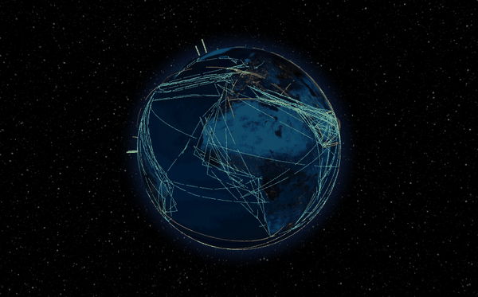

# Terra Atlas

**A living 3D Earth to explore and learn from — on the web and on your desktop.**
Built on [World Monitor](https://github.com/koala73/worldmonitor) by Elie Habib.

[](https://normansrule.github.io/worldmonitor/app/)
[](https://normansrule.github.io/worldmonitor/)
[](https://github.com/Normansrule/worldmonitor/releases/latest)

[](LICENSE)
[](https://github.com/Normansrule/worldmonitor/actions/workflows/pages.yml)
[](https://github.com/Normansrule/worldmonitor/actions/workflows/desktop.yml)


[The site](#-the-site) · [The globe](#-the-globe) · [Layers](#-layer-catalogue) · [Learn](#-learning-built-in) · [Desktop app](#-desktop-and-installable-app) · [Run it](#-run-it-yourself) · [How it works](#-how-it-works) · [Credits](#-credits)

</div>

---

## ◎ New in v1.4 — the connected planet

| | |
|---|---|
| **Overwatch HUD** | Sensor look 5 (or the *HUD* button): a heads-up display over the globe with a rotating crosshair and live read-outs of what is within range — flights, cameras, power, networks, radio — and the nearest of each. |
| **Area scan (press S)** | Pulls every public layer together for the spot under the crosshair: aircraft in range, the tracked satellites that can see that spot *right now* (computed with SGP4 look angles), cameras, internet buildings, power plants, radio receivers, weather, local time and the nearest of each, one click away. |
| **NASA satellite overlays** | Wrap the globe in today’s clouds, rain and snow from the last 30 minutes (IMERG), active fires, last night’s lights, sea-surface temperature, smoke and dust, or snow cover — NASA GIBS images on a transparent shell. |
| **Power plants** | 10,700 plants ≥ 50 MW from the WRI Global Power Plant Database, coloured by fuel with a fuel filter, capacity, generation and owner. |
| **Internet exchanges & data centres** | PeeringDB colocation buildings sized by the number of networks inside — where the internet physically meets. |
| **Live radio receivers** | Public KiwiSDR shortwave receivers worldwide; click one to open it and listen live from that spot on Earth. |
| **Live ships** | Every AIS-broadcasting vessel in the Baltic from Fintraffic’s open feed, plus Finnish road weather cameras in the camera layer. |
| **Satellite footprints** | Any satellite card now shows *What can it see right now?* — the circle of Earth inside its horizon. |

---

## 🔴 New in v1.3

| | |
|---|---|
| **Live ticker + Live feed** | A red ticker under the search bar streams what is happening now — earthquakes, storms and wildfires, news, and aircraft squawking emergency codes. The **Live** button opens the full feed with filters; **Start live tour** flies from event to event hands-free. |
| **News pins** | Places in the news in the last 24 hours (GDELT), by topic — top stories, disasters, conflict, protests, science, climate — each with its headlines and links to the original articles. |
| **Crime maps** | Official incident reports for Chicago, San Francisco, New York City, Los Angeles and all of England, Wales and Northern Ireland, as 3D hexagon density columns plus pins, with dates, categories and a lesson on reading the numbers fairly. |
| **Camera wall** | Twelve live cameras nearest the centre of your view in one grid, refreshing every 20 s. Plus London JamCams and Hong Kong cameras. |
| **Apply button and presets** | Tick and untick layers, then press **Apply** — nothing changes until you do. One-click presets: Live world, Aviation, Cameras, Crime & civic, Space, Earth science, Infrastructure. Every layer shows a live count. |
| **Flight emergencies** | Aircraft squawking 7500 / 7600 / 7700 are drawn large in red with a pulsing ring and pushed to the Live feed. |
| **Fixes** | Shared objects no longer vanish when layers are toggled (the cause of flights or pins disappearing), and the first visit after an update resets old layer lists saved in the address bar so new layers actually appear. A **What’s new** card and a version badge show which build you are on. |

---

## ✨ New in v1.1

| | What you get |
|---|---|
| ✈️ **Every flight in the sky** | Live aircraft worldwide (OpenSky) or in detail around your view (adsb.lol), drawn as plane pointers turned to their real heading and coloured by altitude — tens of thousands in a single draw call. |
| 🪟 **Seatback flight view** | Click a plane for an airline-screen style panel: origin → destination with progress, altitude, ground speed, heading, climb rate, outside air temperature, distance and time to go, weather and local time at the destination, and a photo of the actual aircraft. *Follow* keeps the camera on it; *Window view* drops you to satellite imagery beneath it. |
| 📹 **Live traffic cameras** | About 6,000 public road cameras: Caltrans (all 12 California districts), NYC DOT, Transport for London JamCams and Hong Kong’s Transport Department (511 Ontario and Alberta when their feeds respond). Stills refresh every 15 s; Caltrans streams play live and London cameras play a recent video clip. Every camera shows the nearest others as a camera wall. |
| 🚨 **Licence-plate readers** | Flock Safety and other ALPR cameras mapped in OpenStreetMap (largely via DeFlock), with maker, operator and facing direction, a neutral Learn card on the privacy debate, and a live refresh from OpenStreetMap for the area you are viewing. |
| 🛰 **Clickable satellites and the ISS** | Click any satellite for its orbit class, perigee and apogee, inclination and period, draw its full orbit, and get the next times it passes over you. |
| 📍 **Map-style pins and names** | 2,500 city names and 3,300 airports appear as you zoom, like a web map. Close up, markers turn into icon pins with labels. Named places get a Wikipedia summary and photo. |
| 👀 **Look around** | Any point: Street View, Google Earth 3D, Mapillary, open Panoramax street photos and the nearest live cameras. |
| 🧭 **Navigation that behaves like Google Maps** | Dragging covers about one screen of ground at any zoom, each scroll notch changes height by about 15 %, double-click zooms in, arrows pan, `+`/`−` zoom, a locate-me button and a scale bar. Lines and markers keep the same on-screen size at every zoom. |
| ⚡ **Faster start** | 2K textures first and 4K when idle, a procedural star field instead of a 900 kB image, a 30 % smaller 3D engine bundle, and capped pixel ratio on high-density screens. |

> Camera lists and the licence-plate-reader snapshot are collected once a day by [`data.yml`](.github/workflows/data.yml) (run it once by hand after installing: `gh workflow run data.yml`). Flights, satellites and camera pictures are always live.

---

## 🌍 What this is

Terra Atlas turns [World Monitor](https://github.com/koala73/worldmonitor) — a real-time global intelligence dashboard — into an **educational 3D Earth that runs entirely from GitHub Pages**. There is no server, no database and no API key. Every live layer is fetched straight from a public, browser-friendly source (USGS, NASA, NOAA, CelesTrak, Open-Meteo, adsb.lol); every static layer comes from World Monitor’s own curated datasets.

You can zoom from orbit down to street level, click anything for field notes, follow guided tours, play a geography quiz, measure great circles, switch the planet into night vision or thermal, stir a fluid simulation, and take the whole thing offline as an installed web app or a desktop app.

<table>
<tr>
<td width="50%"><a href="https://normansrule.github.io/worldmonitor/app/">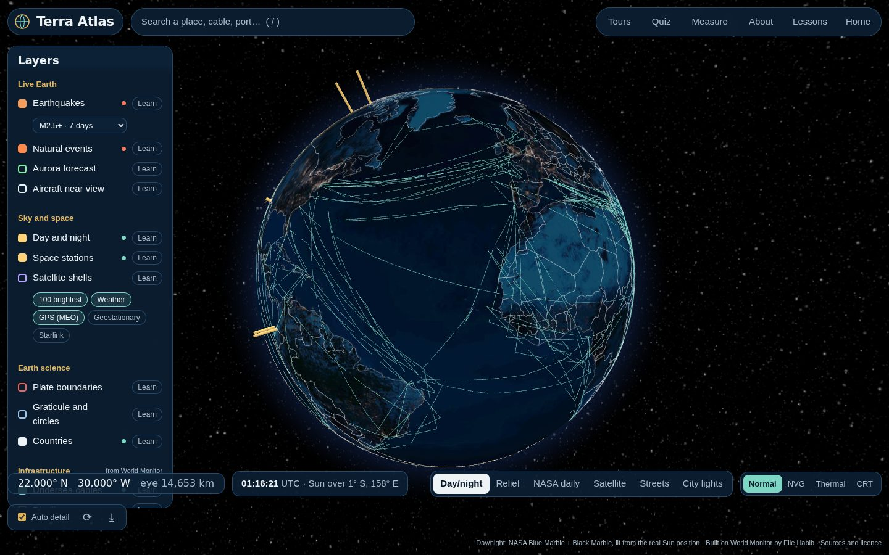</a><br/><b>Real day and night.</b> The globe is lit from the Sun’s actual position; the night side shows NASA’s city lights.</td>
<td width="50%"><a href="https://normansrule.github.io/worldmonitor/app/?tour=ring-of-fire">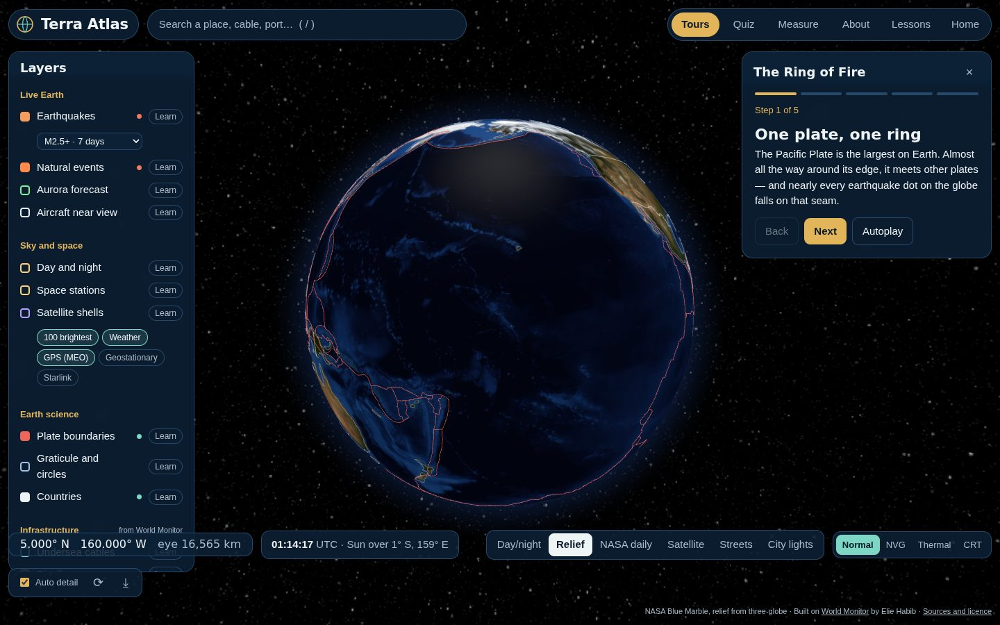</a><br/><b>Guided tours.</b> Six narrated stories fly the camera and switch on the layers they need.</td>
</tr>
<tr>
<td>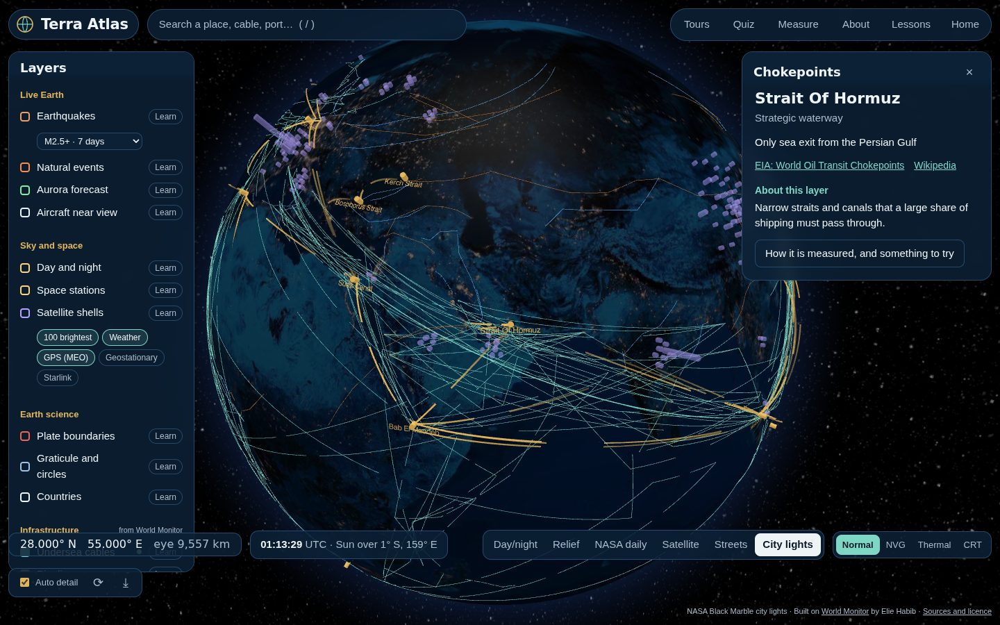<br/><b>The world’s plumbing</b> — World Monitor’s cables, pipelines, trade routes and chokepoints.</td>
<td>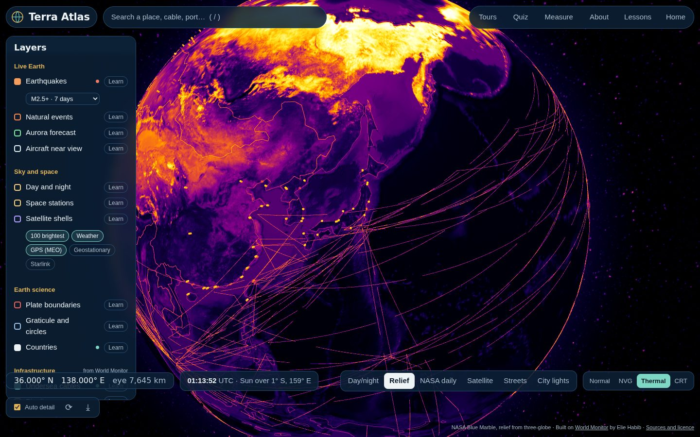<br/><b>Sensor looks</b> — Normal, night vision, thermal and CRT (keys 1–4).</td>
</tr>
<tr>
<td>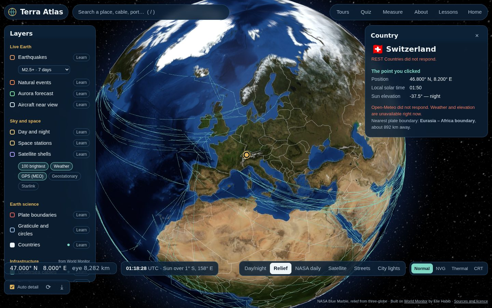<br/><b>Country cards and point probes</b> — live facts, World Bank indicators, weather, elevation and the nearest plate boundary.</td>
<td>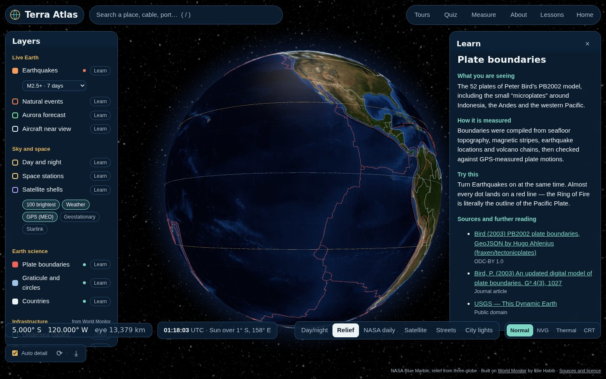<br/><b>Learn cards on every layer</b> — what you see, how it’s measured, something to try, and sources.</td>
</tr>
</table>

---

## 🧭 The site

GitHub Pages serves everything in [`site/`](site/). Each page is plain HTML, CSS and JavaScript.

| Page | What it’s for | Preview |
|---|---|---|
| **[Home](https://normansrule.github.io/worldmonitor/)** · `site/index.html` | Landing page with a live, rotating globe, animated with GSAP | 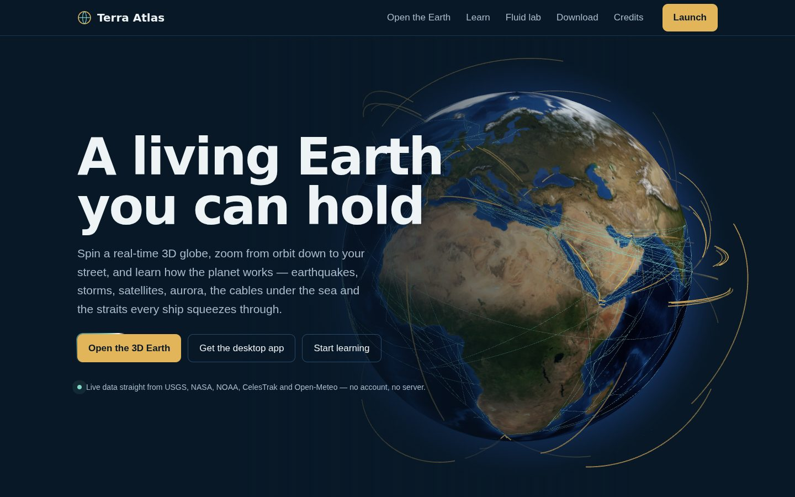 |
| **[The globe](https://normansrule.github.io/worldmonitor/app/)** · `site/app/` | The full Terra Atlas app — layers, tours, quiz, measure, search |  |
| **[Learn](https://normansrule.github.io/worldmonitor/learn/)** · `site/learn/` | Nine lessons with equations, sources and “open on the globe” buttons | 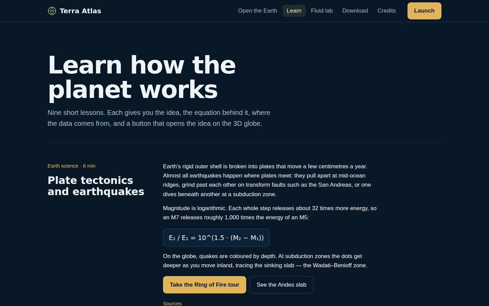 |
| **[Fluid lab](https://normansrule.github.io/worldmonitor/fluid/)** · `site/fluid/` | Pavel Dobryakov’s WebGL fluid simulation with cyclone, trade-wind and jet-stream presets | 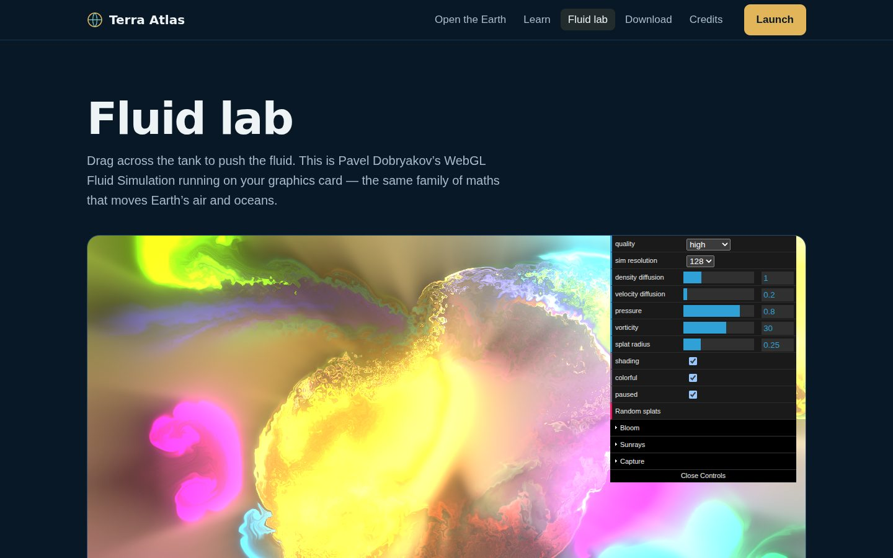 |
| **[Download](https://normansrule.github.io/worldmonitor/download/)** · `site/download/` | Desktop builds, installing as a web app, running from source | 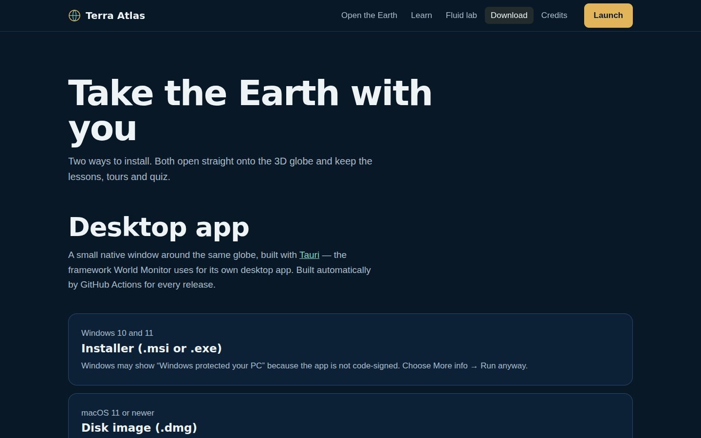 |
| **[Credits](https://normansrule.github.io/worldmonitor/credits/)** · `site/credits/` | Every project, library and dataset, with its licence | 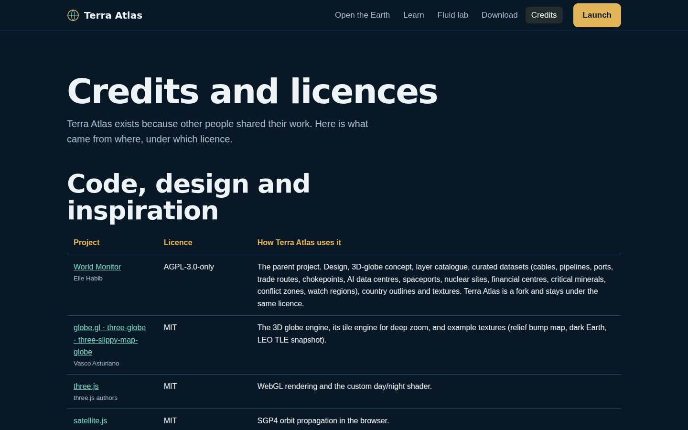 |

---

## 🌐 The globe

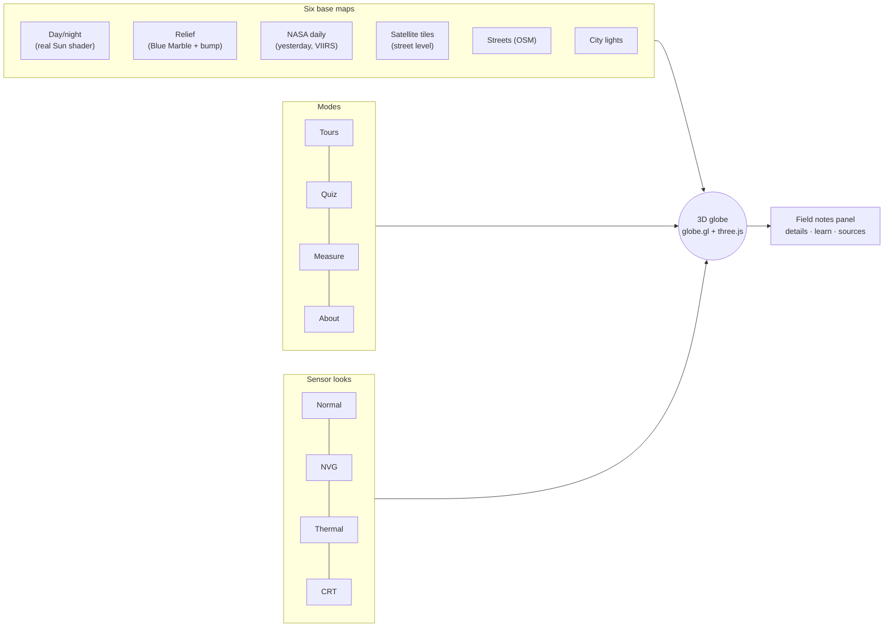

- **Zoom to street level.** Scroll in and *Auto detail* swaps the texture for satellite tiles once you’re close; choose *Satellite* or *Streets* to stay in tile mode.
- **Click anything.** Points, lines and areas open field notes. Bare ground opens a point probe (weather, elevation, local solar time, Sun elevation, nearest plate boundary). A country opens its fact card.
- **Search** across 1,000+ features — cables, ports, data centres, countries, tours, layers — or press Enter to search the whole world with OpenStreetMap.
- **Share a view.** The address bar always holds your camera, base map and layers, e.g. `app/#@26.5,56.3,0.35&b=imagery&l=waterways,routes`.
- **Keyboard:** `S` area scan · `5` HUD · `/` search · arrows pan · `+`/`−` zoom · double-click zoom in · `R` spin · `1–4` sensor looks · `T` tours · `Q` quiz · `M` measure · `Esc` close.

---

## 🗂 Layer catalogue

| Group | Layer | Source | Updates |
|---|---|---|---|
| Live Earth | Earthquakes (depth-coloured, pulsing rings for M4.5+) | USGS | 5 min |
| | Natural events + storm tracks | NASA EONET | 30 min |
| | Aurora forecast | NOAA SWPC OVATION | 15 min |
| | Live flights (worldwide or near view) + seatback flight view | OpenSky · adsb.lol · airplanes.live · adsbdb | 12 s – 60 s |
| Cameras | Live traffic cameras (stills, live video, clips) | Caltrans · NYC DOT · TfL · Hong Kong TD · 511 Ontario/Alberta | list daily, images live |
| | Licence-plate readers (Flock and others) — 150,000+ mapped; density grid when zoomed out | OpenStreetMap / DeFlock · Overpass | weekly + on demand |
| Places | City names (zoom-dependent) · Airports | Natural Earth · OurAirports | static |
| Live Earth | News pins by topic | GDELT GEO 2.0 | 15 min |
| Connected planet | Power plants · Internet exchanges & data centres · Live radio receivers · Live ships (Baltic) · NASA overlays | WRI · PeeringDB · KiwiSDR · Fintraffic Digitraffic · NASA GIBS | static / daily / 1 min / 30 min |
| Civic data | Reported crime (hexagon density + pins) | Chicago · DataSF · NYC Open Data · LA City · data.police.uk | on view |
| Sky and space | Day and night (terminator, subsolar point) | computed | 1 min |
| | Space stations + ISS ground track | CelesTrak + SGP4 | 2 s |
| | Satellite shells (brightest, weather, GPS, geostationary, Starlink) | CelesTrak + SGP4 | 3 s |
| Earth science | Plate boundaries | PB2002 (Bird 2003) | static |
| | Graticule, tropics, polar circles | computed | static |
| | Countries (hover + fact card) | World Monitor / Natural Earth | static |
| Infrastructure *(World Monitor)* | Undersea cables · pipelines · trade routes · chokepoints · ports · AI data centres · nuclear sites · spaceports · financial centres · critical minerals | World Monitor curated datasets | static |
| Geopolitics *(World Monitor)* | Conflict zones · watch regions | World Monitor curated datasets | static |

---

## 🎓 Learning built in

<table><tr>
<td width="55%">

**Thirteen lessons** on the [Learn page](https://normansrule.github.io/worldmonitor/learn/), each with the key equation, its sources and a button that opens the idea on the globe:

1. Plate tectonics and earthquakes — `E₂/E₁ = 10^(1.5·ΔM)`
2. Orbits — Kepler’s third law, `T = 2π√(a³/μ)`
3. Day, night and the seasons — solar declination
4. Undersea cables and the speed of light in fibre
5. Chokepoints of world trade
6. Aurora and space weather — the Kp index
7. Great circles and map projections — haversine
8. Reading satellite imagery — NASA GIBS / VIIRS
9. Fluids — Navier–Stokes, stable fluids, Coriolis
10. How flight tracking works — ADS-B and the standard atmosphere
11. Cameras, maps and privacy
12. Reading crime data responsibly
13. How the internet is wired

</td>
<td>

**Six guided tours** in the app:

| Tour | Layers it switches on |
|---|---|
| The Ring of Fire | quakes, plates, events |
| Arteries of the internet | cables, day/night |
| Chokepoints of world trade | routes, chokepoints, ports |
| Orbits 101 | stations, satellite shells |
| Day, night and the seasons | Sun, graticule |
| Energy, compute and minerals | data centres, pipelines, nuclear, mines |

Plus **“Where on Earth?”** — an eight-round quiz scored by great-circle distance — and **Measure**, which reports distance, bearing and one-way light time in fibre.

</td></tr></table>

---

## 💻 Desktop and installable app

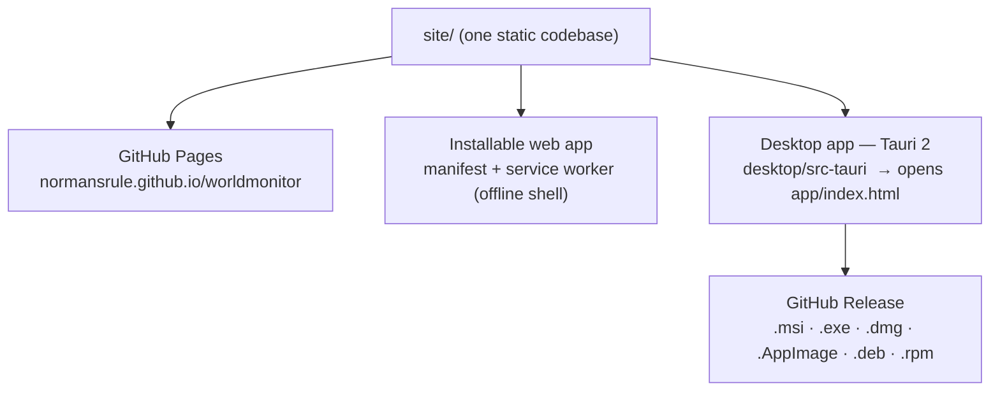

- **Web app:** open the globe in Chrome or Edge and choose *Install Terra Atlas*. The shell, textures and datasets are cached for offline use; live layers refresh when you reconnect.
- **Desktop app:** [`desktop/`](desktop/) wraps the same `site/` folder in [Tauri](https://tauri.app) — the framework World Monitor uses for its own desktop build. The window opens directly on the globe; outside links open in your browser.
- **Releases:** push a version tag and GitHub Actions builds Windows, macOS (Apple silicon and Intel) and Linux packages and attaches them to a release:

```bash
git tag v1.0.0 && git push origin v1.0.0     # → Actions → "Build desktop app" → Releases
```

The builds are not code-signed, so Windows SmartScreen and macOS Gatekeeper will ask you to confirm the first launch (the Download page explains how).

---

## 🚀 Run it yourself

**Preview locally** (any static server):

```bash
cd site && python3 -m http.server 8080          # open http://localhost:8080
```

**Set up your fork** (Ubuntu / WSL):

```bash
git clone git@github.com:Normansrule/worldmonitor.git && cd worldmonitor
git remote add upstream https://github.com/koala73/worldmonitor.git
git mv README.md README.worldmonitor.md          # keep the original README
unzip -o ~/terra-atlas-overlay.zip -d .          # adds site/, desktop/, video/, tools/, docs/ …
bash tools/setup-fork.sh                         # parks upstream CI workflows, checks files
git add -A && git commit -m "Add Terra Atlas: static site, desktop app, docs" && git push
```

Then **Settings → Pages → Source: GitHub Actions**. The [`pages.yml`](.github/workflows/pages.yml) workflow publishes `site/` on every push.

**Refresh World Monitor’s data** after pulling upstream:

```bash
git fetch upstream && git merge upstream/main
npm i --no-save esbuild && node tools/extract-upstream-data.mjs    # rewrites site/app/data/worldmonitor-static.json
```

**Regenerate screenshots, GIF and promo video:**

```bash
pip install playwright && python -m playwright install chromium
(cd site && python3 -m http.server 8765 &) ; python3 tools/screenshots.py ; python3 tools/make_gif.py
# promo video: Actions → "Render promo video", or locally:  cd video && npm install && npm run render
```

---

## 🔧 How it works

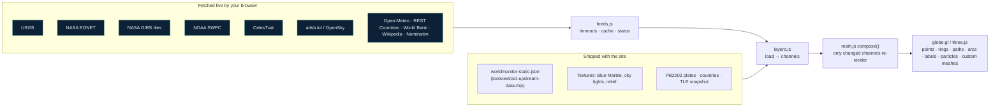

- **Every layer is one object** in [`site/app/js/layers.js`](site/app/js/layers.js): `load()` fetches data, `channels()` turns it into globe primitives, `describe()` writes the field notes, and `learn` holds the teaching text and sources. Adding a layer means adding one object.
- **Satellites are computed in your browser** with SGP4 ([satellite.js](https://github.com/shashwatak/satellite-js)). If CelesTrak is unreachable, a bundled snapshot keeps the low orbits populated and the card says so.
- **Performance:** the 258 country outlines are merged into one line mesh, hover uses a point-in-polygon lookup instead of ray-casting, and `compose()` only hands globe.gl the channels that changed.
- **Honest failure:** each layer shows a status dot; if a source is down or blocked, its Learn card says what failed and suggests trying later.

```
site/                       ← everything GitHub Pages serves
├── index.html              landing page (GSAP, live hero globe)
├── app/                    the Terra Atlas globe app
│   ├── js/                 main, layers, feeds, astro, satellites, tours, quiz, sources
│   ├── data/               World Monitor export, countries, plates, TLE snapshot
│   ├── textures/           NASA day, night, relief, star field
│   └── vendor/             globe.gl + three.js + satellite.js bundle
├── learn/  fluid/  download/  credits/
├── assets/                 shared site CSS/JS + GSAP
├── manifest.webmanifest  sw.js  icons/
desktop/                    Tauri 2 desktop shell (packages site/)
video/                      Remotion promo video
tools/                      data export, camera + ALPR fetchers, setup, screenshots, GIF
.github/workflows/          pages.yml · desktop.yml · video.yml · data.yml
```

---

## 🙏 Credits

**Terra Atlas is a fork of [World Monitor](https://github.com/koala73/worldmonitor) by [Elie Habib](https://github.com/koala73).** Its design, 3D-globe concept, layer catalogue, curated datasets, country outlines and textures come from that project. The original README is kept as [`README.worldmonitor.md`](README.worldmonitor.md), and every change is listed in [`NOTICE.md`](NOTICE.md).

| Project | How Terra Atlas uses it |
|---|---|
| [World Monitor](https://github.com/koala73/worldmonitor) · AGPL-3.0 | Parent project — design, datasets, textures |
| [globe.gl](https://github.com/vasturiano/globe.gl) · [three.js](https://github.com/mrdoob/three.js) · MIT | 3D globe, tile engine, shaders |
| [satellite.js](https://github.com/shashwatak/satellite-js) · MIT | SGP4 orbit propagation |
| [God’s Eye View](https://github.com/bilawalsidhu/gods-eye-view) · MIT | Inspiration for sensor looks; pointed us to NASA GIBS and adsb.lol |
| [WebGL Fluid Simulation](https://github.com/PavelDoGreat/WebGL-Fluid-Simulation) · MIT | Powers the Fluid lab |
| [GSAP](https://github.com/greensock/GSAP) · Standard no-charge licence | Page animations |
| [Magic UI](https://github.com/magicuidesign/magicui) · [React Bits](https://github.com/DavidHDev/react-bits) · [Motion Primitives](https://github.com/ibelick/motion-primitives) · [Animate UI](https://animate-ui.com/) | Effects re-implemented in plain CSS/JS: border beam, number ticker, marquee, split text, spotlight, tilt |
| [Remotion](https://github.com/remotion-dev/remotion) | Promo video rendered from code |
| [LLM Visualization](https://github.com/bbycroft/llm-viz) · [Transformer Explainer](https://github.com/poloclub/transformer-explainer) · [Bruno Simon’s folio](https://github.com/brunosimon/folio-2019) | Inspiration for narrated tours, “what / how / try” cards and playful 3D |
| [hls.js](https://github.com/video-dev/hls.js) · Apache-2.0 | Live camera video |
| [Tauri](https://github.com/tauri-apps/tauri) · MIT/Apache-2.0 | Desktop app |

Data: WRI Global Power Plant Database (CC BY 4.0) · PeeringDB · KiwiSDR receiver owners · Fintraffic / digitraffic.fi (CC BY 4.0) · GDELT Project · City of Chicago · DataSF · NYC Open Data · City of Los Angeles · data.police.uk (OGL v3) · Caltrans · NYC DOT · Transport for London (OGL) · Hong Kong Transport Department · 511 Ontario · 511 Alberta · © OpenStreetMap contributors via DeFlock and Overpass · OpenSky Network · airplanes.live · adsbdb (routes looked up live, not stored) · OurAirports · Natural Earth · Panoramax (CC BY-SA) · USGS · NASA EONET · NASA GIBS (*we acknowledge the use of imagery provided by services from NASA’s Global Imagery Browse Services (GIBS), part of NASA’s Earth Science Data and Information System (ESDIS)*) · NOAA SWPC · CelesTrak · adsb.lol (ODbL) · OpenSky Network · Open-Meteo (CC BY 4.0) · REST Countries · World Bank (CC BY 4.0) · Wikipedia (CC BY-SA) · © OpenStreetMap contributors (ODbL) · Esri World Imagery · PB2002 plate boundaries (ODC-BY) · NASA Blue Marble and Black Marble. Full list with licences: [`docs/REFERENCES.md`](docs/REFERENCES.md).

## 📄 License

**AGPL-3.0-only**, the same as World Monitor. You may use, study, share and modify this project; if you run a modified version for others over a network, you must offer them its source. See [`LICENSE`](LICENSE).
